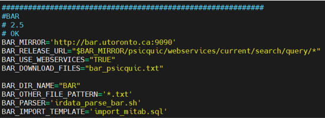

irdownload
==========
| 

In this step the raw data will be downloaded in the data folder, by using the next command we can download all the data all at once::

	irdownload --all 1>/data/irdata18/logs/irdownload.all.log 2>&1 &
| 
It is highly advised to execute these commands in a tmux environment because they can take a long time.
Downloading the data all at once is not a good practice, the data sources could have been changed in between the versions of each build. 
The irdata-config file can be eddited respectivly if the data sources change or if data sources are being added. 
An example of these configurations is shown here:

     
    irdata-config(bar configuration)
| 
The sources can be downloaded seperatly as seen in the next code block::

	irdownload BAR 1>/data/irdata18/logs/irdownload.bar.log 2>&1 &
| 
Next step:

:doc:`irmanifest`
