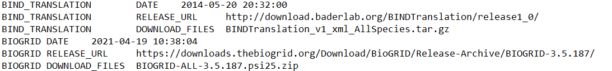

irmanifest
==========
| 
irmanifest makes a file with all the information of the acquired sources:: 

	irmanifest --all 1>/data/irdata18/logs/irmanifest.log 2>&1 &

A part of the manifest file is shown below:

    irmanifest

|
Next step:

:doc:`irparse`

