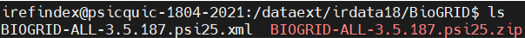
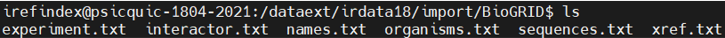
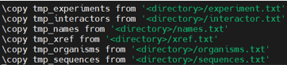

irparse
=======
|
irparse coverts the downloaded data to files which can be imported into the database

        irparse --all 1>/data/irdata18/logs/irparse.log 2>&1 &

The data flow is shown below:

    unpacked data

| 

    irparse output

| 

    irimport imports parsed data

| 
Next step:

:doc:`irimport`
